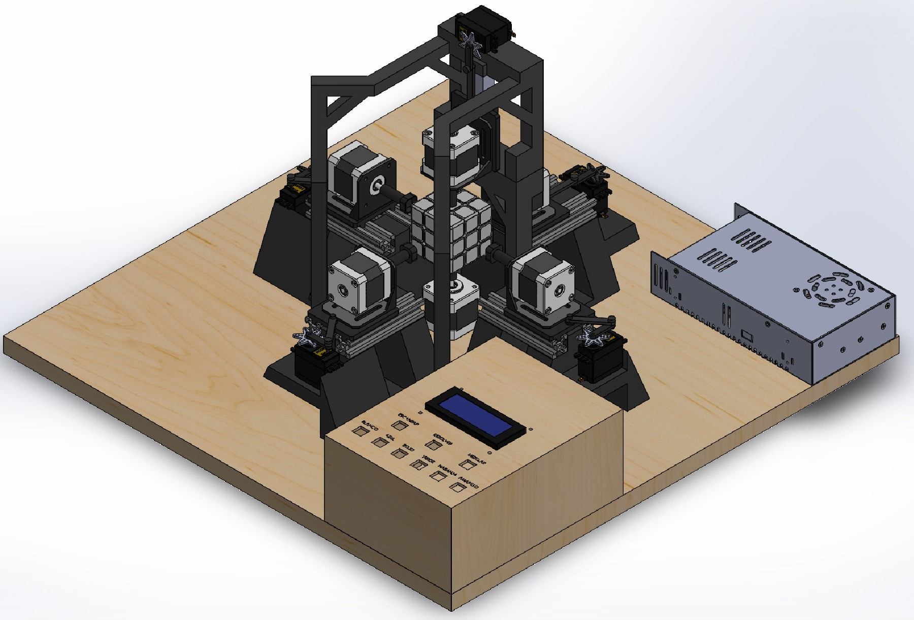

# Rubik's Cube Robot :robot: 

This prototype aims to solve a Rubik's cube. It was originally developed as a microcontrollers project. Later on was expanded integrating artificial vision.

## :brain: Project Overview 

All parts were designed by me, using Solidworks and 3D Printed. It uses stepper motors to rotate the cube's faces by attaching an actuator in the motor shaft. The goal is to remove the central plastic cap of each face of the cube.

## Hardware :gear:
- **Microcontrolle**r: STM32 Discovery Board
- **Motors**: NEMA17 Stepper Motors
- **Motor Drivers**: A4988-MR
- **Display**: 16 x 2 LCD Screen with I2C module
- **Power supply**: External

### Expasion :up:
- Camera: Logitech

## :hammer_and_wrench: 3D Modeling and machined parts
- 3D Printed chassis to keep motors in a 6 axis fashion and cube in place
- Aluminum profile (Bosch profile)

All parts and assembly in '/cad' folder.

## Images :camera:

## :film_projector: Video
- [Prototype Explanation and Solving Example](https://youtu.be/PElHr9mIuuI?si=LBbM1NEf3MKbrfhR)
- [Color Detection System](https://www.youtube.com/watch?v=Fha9vGLGpn8)
